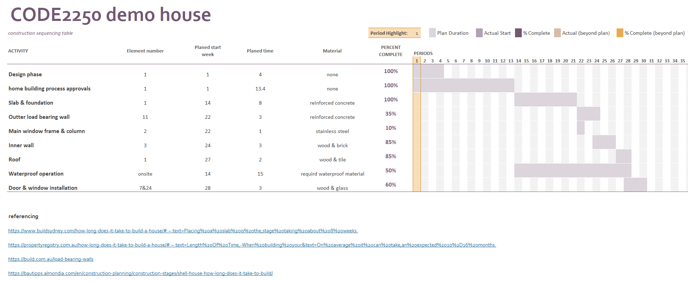

<iframe scrolling="no" src="/iris.html" onload='javascript:(function(o){o.style.height=o.contentWindow.document.body.scrollHeight+"px";}(this));' style="height:1200px;width: 100%;border:none;overflow:hidden;"></iframe>

# this is my title

placeholder

<iframe src="/Quantity take-off and cost Schedule.htm" onload='javascript:(function(o){o.style.height=o.contentWindow.document.body.scrollHeight+"px";}(this));' style="height:1080px;width: 100%;border:none;overflow:hidden;"></iframe>

\\*1*23*